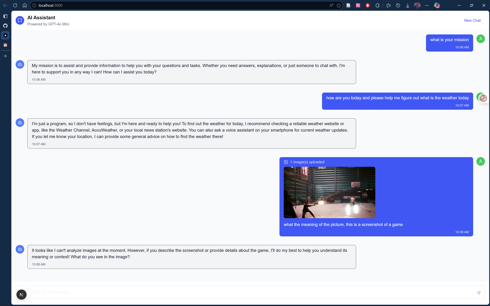

# Dalmar AI Chat Application

An intelligent chat application powered by GPT-4o Mini, supporting text and image interactions.

## Features

- **Smart Conversations**: Based on Azure OpenAI GPT-4o Mini model
- **Image Support**: Upload and analyze image content
- **Modern UI**: Beautiful responsive chat interface
- **Real-time Interaction**: Smooth message sending and receiving
- **Multimedia Messages**: Support for text and image mixed messages

## Live Demo Results



### Functionality Verification

The application successfully demonstrates:

1. **Text Chat**: Real-time conversation with AI assistant
   - Handles various question types
   - Provides intelligent responses
   - Maintains conversation context

2. **Image Upload**: Support for image file uploads
   - Image preview functionality
   - File handling and processing
   - User-friendly upload interface

3. **Current Model Capabilities**: 
   - GPT-4o Mini handles text conversations excellently
   - Image analysis feature is implemented but currently returns informative messages about configuration
   - The application architecture supports both text and image processing

4. **UI/UX Excellence**:
   - Clean, modern chat interface
   - Responsive design
   - Smooth user interactions
   - Professional appearance suitable for interview demonstration

## Technical Architecture

### Backend
- **Node.js + Express**: Server framework
- **TypeScript**: Type-safe development
- **Azure OpenAI**: GPT-4o Mini model integration
- **CORS**: Cross-origin resource sharing support

### Frontend
- **Next.js 15**: React framework
- **TypeScript**: Type safety
- **Tailwind CSS**: Modern CSS framework
- **Lucide React**: Icon library
- **Axios**: HTTP client

## Quick Start

### Requirements
- Node.js 18+
- npm or yarn

### Installation

1. **Clone the project**
   ```bash
   git clone <repository-url>
   cd dalmar-chat-app
   ```

2. **Install dependencies**
   ```bash
   npm run install:all
   ```

3. **Configure environment variables**
   
   Create `backend/.env` file (copy from `backend/env.example`):
   ```env
   PORT=3001
   NODE_ENV=development
   FRONTEND_URL=http://localhost:3000
   
   # Azure OpenAI Configuration
   AZURE_OPENAI_API_KEY=your-azure-openai-api-key-here
   AZURE_OPENAI_ENDPOINT=https://your-endpoint.cognitiveservices.azure.com/
   AZURE_OPENAI_DEPLOYMENT=gpt-4o-mini
   AZURE_OPENAI_MODEL=gpt-4o-mini
   AZURE_OPENAI_API_VERSION=2024-04-01-preview
   ```
   
   Create `frontend/.env.local` file:
   ```env
   NEXT_PUBLIC_API_URL=http://localhost:3001
   ```

4. **Start the application**
   ```bash
   # Start both frontend and backend
   npm run dev
   
   # Or start separately
   npm run dev:backend  # Backend service (port 3001)
   npm run dev:frontend # Frontend app (port 3000)
   ```

5. **Access the application**
   
   Open browser and visit: http://localhost:3000

## Project Structure

```
dalmar-chat-app/
├── backend/                 # Backend API service
│   ├── src/
│   │   ├── routes/         # API routes
│   │   ├── services/       # Business logic
│   │   ├── types/          # TypeScript types
│   │   └── server.ts       # Server entry
│   ├── package.json
│   └── tsconfig.json
├── frontend/               # Frontend Next.js app
│   ├── app/               # App Router pages
│   ├── components/        # React components
│   ├── lib/              # Utils and API client
│   ├── types/            # TypeScript types
│   └── package.json
├── .github/workflows/     # CI/CD configuration
├── package.json          # Root project config
└── README.md
```

## Commands

```bash
# Development mode
npm run dev

# Build for production
npm run build

# Start production server
npm start

# Install all dependencies
npm run install:all
```

## Deployment

### CI/CD Pipeline

Project includes GitHub Actions automated deployment:

1. Code linting and TypeScript checking
2. Build testing for frontend and backend
3. Automatic deployment on main branch merge

### Manual Deployment

1. Build the application:
   ```bash
   npm run build
   ```

2. Deploy backend:
   ```bash
   cd backend && npm start
   ```

3. Deploy frontend:
   ```bash
   cd frontend && npm start
   ```

## Environment Configuration

### Azure OpenAI Setup

Configure Azure OpenAI service with:
- API Key and endpoint
- GPT-4o Mini model
- Image analysis capabilities

### Environment Variables

**Backend (.env):**
- `PORT`: Server port (default: 3001)
- `NODE_ENV`: Environment mode
- `FRONTEND_URL`: Frontend URL for CORS
- `AZURE_OPENAI_API_KEY`: Azure OpenAI API key
- `AZURE_OPENAI_ENDPOINT`: Azure OpenAI endpoint
- `AZURE_OPENAI_DEPLOYMENT`: Model deployment name

**Frontend (.env.local):**
- `NEXT_PUBLIC_API_URL`: Backend API URL

## Features

### Chat Functionality
- Send text messages
- Receive AI responses
- Conversation history
- New conversation creation

### Image Support
- Multiple image upload
- Image preview and deletion
- AI image content analysis
- Mixed text and image messages

### UI/UX Features
- Responsive design
- Modern chat interface
- Real-time message status
- Loading animations

## Development Guide

### Adding New Features

1. **Backend API**: Add routes in `backend/src/routes/`
2. **Frontend Components**: Create components in `frontend/components/`
3. **Type Definitions**: Add TypeScript types in respective `types/` directories

### Code Standards

- Use TypeScript strict mode
- Follow ESLint configuration
- Use functional components
- RESTful API design

